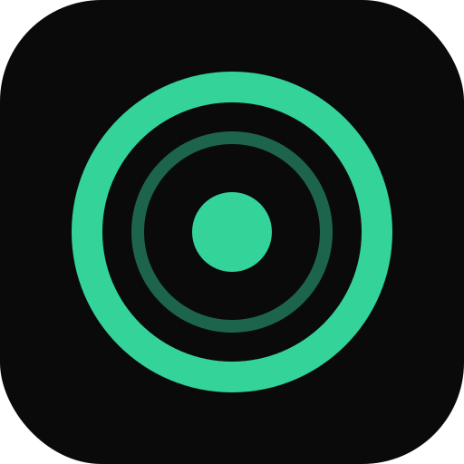
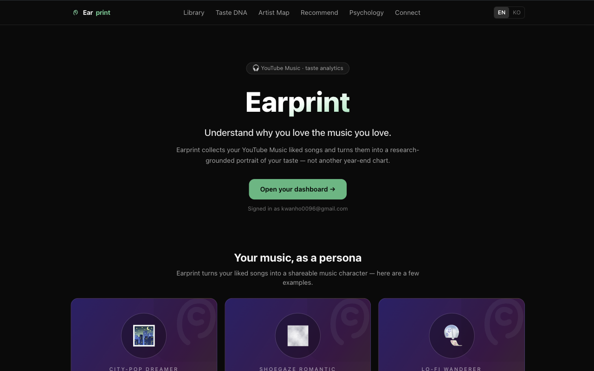
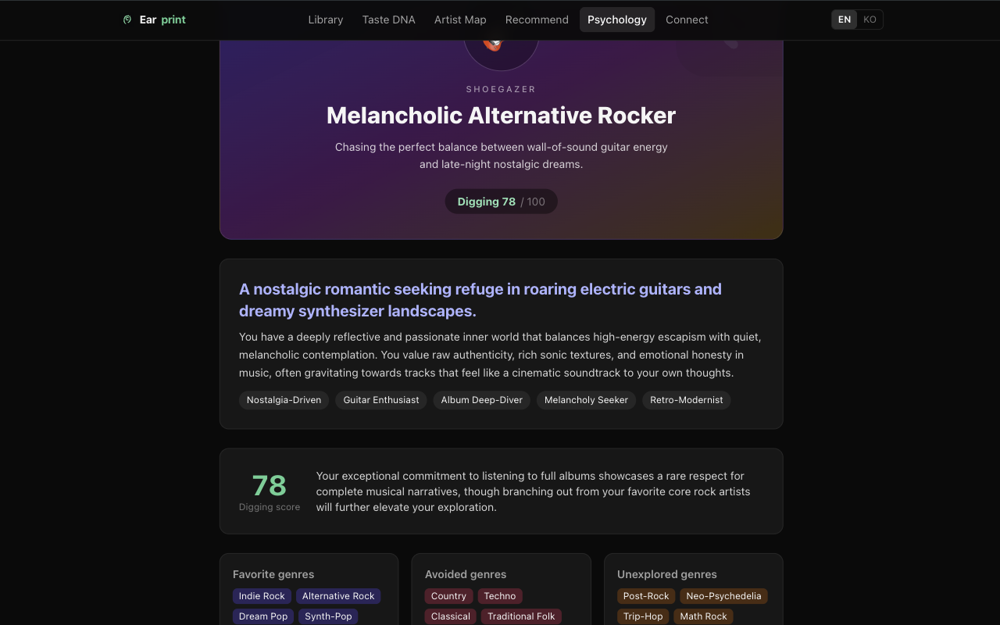
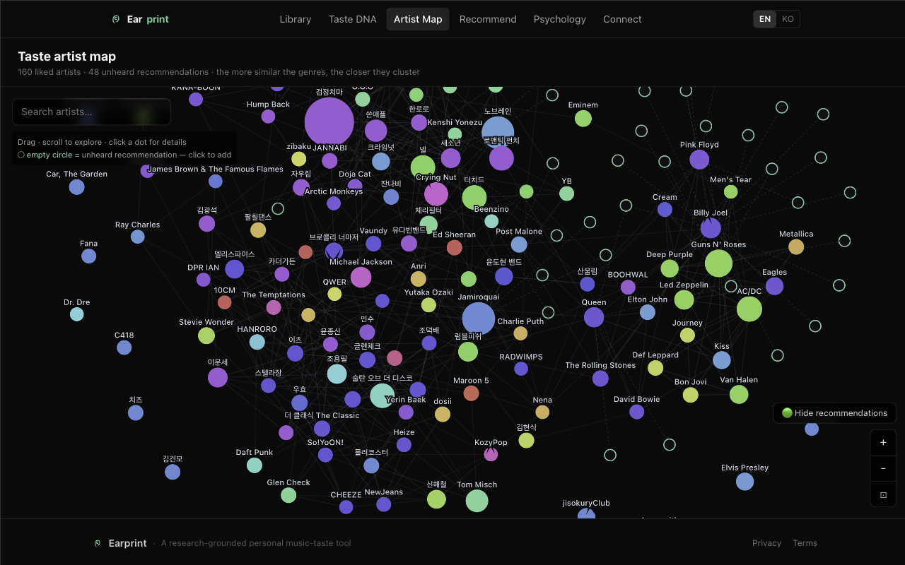
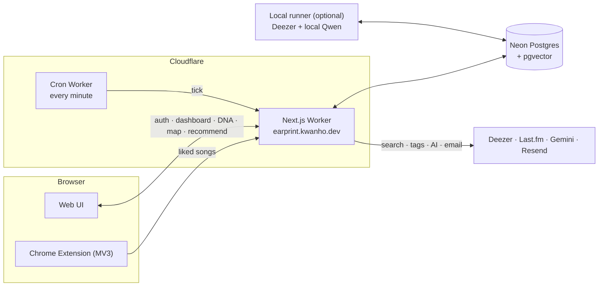
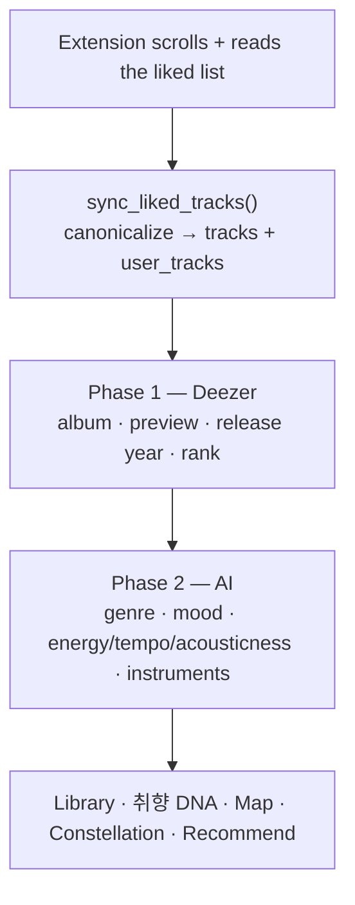

<div align="center">
  
  <h1>Earprint</h1>
</div>

A web service + Chrome extension that collects your YouTube Music **liked
songs**, analyzes them, and turns them into an interactive picture of *why* you
like what you like — grounded in music-psychology research, not just top-N
charts.

> Live: https://earprint.kwanho.dev
> (When self-hosting, use your own Google OAuth credentials.)

See [ARCHITECTURE.md](./ARCHITECTURE.md) for design decisions and
[DEPLOY.md](./DEPLOY.md) for deployment.

## A look inside

**Landing & shareable music personas**



**AI music-psychology profile**



**Interactive artist map**



---

## What it does

| Area | Feature |
|---|---|
| **Collect** | Chrome extension (MV3) scrapes the YouTube Music "Liked Music" list and uploads it |
| **Analyze** | Deezer enrichment (album, preview, release year, popularity) + AI analysis (genre · mood · energy/tempo/acousticness · instruments) |
| **Library** | Dashboard — top artists / genres / moods / instruments, album-depth, audio-feel, artist exclusion |
| **취향 DNA** | Two research-grounded lenses: the **reminiscence-bump "imprint core"** and the **prediction ↔ novelty index** |
| **Artist map** | Interactive force-directed map of your artists; **unheard but related artists** appear as empty circles you can add with one tap |
| **Genre constellation** | Interactive graph of genres, linked when they co-occur on the same tracks |
| **Recommend** | Five modes (song · genre · unheard-genre · indie · mix), Tinder-style swipe rating; liked/known picks fold back into the library |
| **Report** | Optional completion email with a taste summary (Resend) |

YouTube Music has no public API, so the extension scrolls the user's own
session and reads the rendered list. It is a personal / educational tool.

## The idea

The app isn't another "Spotify Wrapped" — it tries to *explain* taste using
three established bodies of research:

- **Prediction & reward.** Musical pleasure peaks at the sweet spot between
  predictability and surprise (Huron's *Sweet Anticipation*; Gold et al., *J.
  Neuroscience* 2019; Salimpoor et al., *Nature Neuroscience* 2011). The
  **novelty index** places a library on a familiarity ↔ novelty axis from genre
  entropy, sub-genre specificity and distance from the mainstream.
- **The reminiscence bump.** Music heard at ~15–25 (emotional peak ≈ 17) is
  encoded with unusually strong memory traces. The **imprint core** overlays
  that window on the library's release-year histogram.
- **Taste trajectory & openness.** Discovery peaks ~24 and crystallizes ~31–33
  as the Openness trait declines (Rentfrow & Gosling, 2003; Cambridge "musical
  ages"). The imprint stage labels a listener as still-digging / imprinted /
  balanced.

## Architecture



Everything is **serverless** — the Next.js app runs on Cloudflare Workers
(OpenNext adapter); a tiny separate **Cron Worker** fires every minute so
background analysis continues after the tab closes.

## Data & analysis pipeline



- **Capture.** The extension scrolls the real YouTube Music UI and reads each
  rendered row (Polymer `.data`, with a DOM-text fallback). It self-diagnoses
  whether it reached the true end of the list.
- **Canonicalization.** `track_canon_key()` folds live versions, re-uploads and
  repeat likes into one canonical `tracks` row; `user_tracks` holds the per-user
  like. Sync is replace-mode for YouTube likes; map/recommendation additions use
  a separate `discover` source that survives re-syncs.
- **Enrichment** is Deezer-only (free, no key). **AI analysis** produces
  genres/moods and audio-feel.

### Cloud or local analysis

The AI phase can run two ways:

| | Where | Cost |
|---|---|---|
| **Cloud** | Cloudflare cron → Google Gemini | paid API |
| **Local** | `pnpm --filter web analyze:local` → your machine | **$0** |

The local runner (`apps/web/scripts/analyze-local.mjs`) connects straight to
the database and uses a **local Qwen model** via any OpenAI-compatible endpoint
(Ollama / LM Studio) — same pipeline, no API bill.

## Recommendation modes

| Mode | Source |
|---|---|
| 🎲 mix | song + unheard-genre blend |
| ❤️ song | Last.fm tracks similar to your liked songs |
| 🎼 genre | top tracks of your dominant genres |
| 🧭 unheard | broad genres you barely touch |
| 💎 indie | similar tracks filtered to low-popularity (smaller) artists |

Ratings feed back: disliked artists are excluded from later runs; liked / "I
already know it" picks are added to the library.

## Tech stack

- **Extension** (`apps/extension`): Manifest V3, TypeScript, Vite + CRXJS
- **Web app / API** (`apps/web`): Next.js (App Router), TypeScript, Tailwind,
  Auth.js (Google OAuth), HTML5 canvas for the force-directed maps
- **Cron worker** (`apps/cron`): scheduled Worker driving background jobs
- **Hosting**: Cloudflare Workers (OpenNext adapter)
- **DB**: Neon Postgres + pgvector
- **External**: Deezer (no auth) · Last.fm · Google Gemini · Resend · local Qwen
- **Monorepo**: pnpm workspaces + Turborepo

## Repo layout

```
apps/
  extension/   Chrome MV3 collector
  web/         Next.js app + API routes + analyze-local.mjs
  cron/        minute cron worker
db/schema.sql  full schema (functions, canonicalization, jobs)
packages/      shared TypeScript types
```

## Status & limitations

- **List completeness** — very large liked lists (2k+) can be slow to scroll;
  the extension reports how much it captured.
- **Metadata coverage** — release year / popularity come from Deezer, which
  doesn't match every track (esp. obscure or non-Western releases), so the
  imprint chart covers the matched subset.
- **No audio-signal MIR yet** — energy/tempo/acousticness are model-estimated,
  not extracted from audio. The `analysis` table reserves columns + a pgvector
  embedding slot for a future Essentia pipeline.

## Self-hosting

1. Create a Neon Postgres DB → apply `db/schema.sql`.
2. Get your own keys: Google OAuth, Last.fm, Gemini (optional if using local
   Qwen), Resend (optional, for email).
3. Deploy `apps/web` to Cloudflare (`pnpm --filter web run deploy`) + register secrets.
4. Build `apps/extension` and load it unpacked in Chrome.

Full steps in [DEPLOY.md](./DEPLOY.md). Self-hosters use **their own keys**.

## License

MIT
