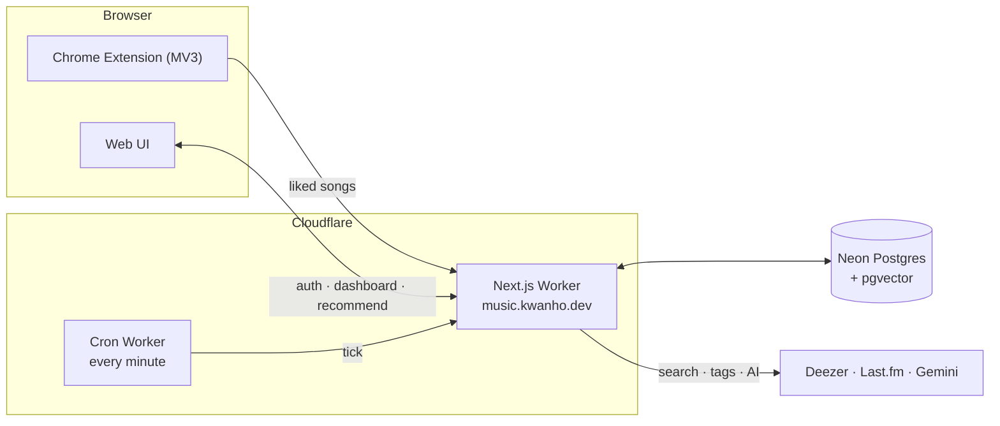
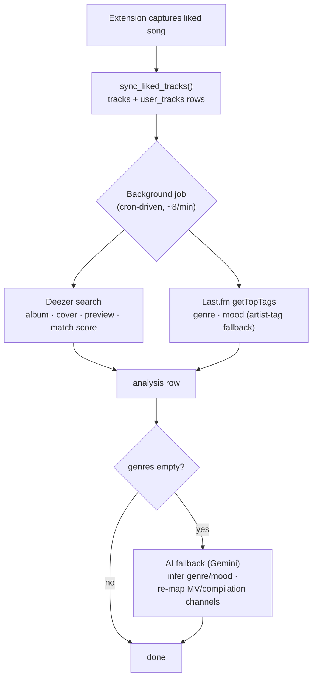
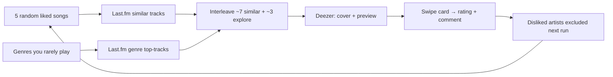

# Playlist Analyzer

A web service + Chrome extension that extracts your YouTube Music "liked"
songs, **analyzes their characteristics (genre, mood)**, generates an
**AI music-psychology profile**, and serves **rated song recommendations**.

> Demo: https://music.kwanho.dev
> (Google OAuth is in test mode — when self-hosting, use your own account.)

See [ARCHITECTURE.md](./ARCHITECTURE.md) for design decisions and
[DEPLOY.md](./DEPLOY.md) for deployment.

---

## Supported services

| Music service | Supported | Notes |
|---|---|---|
| **YouTube Music** | ✅ | Liked-songs (LM) collected via the Chrome extension |
| Spotify | ❌ | Not supported |
| Apple Music | ❌ | Not supported |

YouTube Music has no public API, so the Chrome extension intercepts the
internal `youtubei` responses within the user's own session to collect the
liked-songs list. (Personal / educational tool.)

## Features — development status

| Phase | Feature | Status |
|---|---|---|
| 1 | Chrome extension — collect liked songs → store in backend | ✅ |
| 2 | Track enrichment — Deezer (album, preview) + Last.fm (genre/mood tags) | ✅ |
| B | AI fallback — Gemini fills empty tracks; MV/compilation channels re-mapped to the real artist | ✅ |
| 1 | Stats dashboard — top artists / genre / mood distribution, artist exclusion | ✅ |
| A | AI music-psychology analysis — Gemini generates personality, taste, digging score, improvement guide | ✅ |
| C | Recommendations — Tinder-style swipe cards, similar + "explore" picks, ratings/comments, feedback loop | ✅ |
| — | Background jobs — cron-driven enrichment that continues after the tab closes | ✅ |
| — | Admin — app stats (owner only) | ✅ |
| D | Listening-history collection (beyond likes) | ⛔ Not implemented |
| 3 | BPM / audio features (MIR) — self-hosted Essentia analysis | ⛔ Not implemented (low priority) |
| 4 | music-map — embedding-based 2D taste visualization | ⛔ Not implemented (depends on MIR) |

### Limitations
- **No BPM analysis** — Deezer's BPM data is sparse, so it is deferred. Reliable
  BPM needs Essentia MIR (a separate Python service), which is low priority.
- **Genre coverage** — even with Last.fm + Gemini, some obscure tracks may have
  no genre.
- **Recommendation playback** — Deezer 30-second previews plus a YouTube Music
  link, not full-track playback.

## Architecture

Everything is **serverless** — no always-on server. The Next.js app runs on
Cloudflare Workers (OpenNext adapter); a tiny separate **Cron Worker** fires
every minute so background enrichment keeps running after the user closes the
tab. The AI calls Google Gemini's hosted API — no model is self-hosted.

### Enrichment & analysis pipeline

### Recommendation flow

## How it works

1. **Capture.** YouTube Music has no public API, so the extension injects a
   script that intercepts the page's internal `youtubei/v1/browse` responses and
   depth-first extracts every track from the liked-songs (LM) playlist.
2. **Sync.** `sync_liked_tracks()` upserts one `tracks` row per YouTube videoId
   plus a per-user `user_tracks` like. Idempotent — re-syncing only adds new likes.
3. **Enrichment** (background job, ~8 tracks/min, cron-driven). Per track:
   **Deezer search** fuzzy-matches `artist + title` for album/cover/30s-preview
   and a match-confidence score; **Last.fm `getTopTags`** turns crowd tags into
   genres/moods — tags are cleaned (sentence-like personal tags, the artist's
   own name, years and duplicates dropped) and fall back to artist-level tags.
4. **AI fallback.** Tracks Last.fm couldn't tag go to Gemini in batches — it
   infers genre/mood, and when the "artist" is a cover/compilation channel it
   extracts the real artist from the title.
5. **Recommendations.** Seeded from 5 random liked songs → Last.fm similar
   tracks, blended with "explore" picks from broad genres the listener rarely
   plays. Rated on a swipe card; disliked artists are excluded from later runs.
6. **AI psychology profile.** Gemini reads the aggregated genre/mood/artist
   distribution and writes a taste profile, a "digging score" and improvement tips.

### Methodology notes & limits

- **Track identity is approximate** — one `tracks` row per videoId, so the same
  song from two videos is two rows. The schema keeps `mbid` / `resolved` for a
  future MusicBrainz-based canonical merge; not implemented yet.
- **Genre/mood are crowd- and LLM-sourced**, not audio-derived — fast and free,
  but only as good as Last.fm tags and Gemini's knowledge.
- **No audio-signal analysis yet** — BPM, key, danceability and embeddings (the
  `analysis` table reserves columns for them) need an Essentia MIR pipeline on a
  Python host. This is the main planned enhancement, deprioritized for now.
- **Recommendations are similarity-based** (Last.fm), not embedding-based; the
  "explore" picks are the current diversity mechanism.

## Tech stack

- **Extension** (`apps/extension`): Manifest V3, TypeScript, Vite + CRXJS
- **Web app / API** (`apps/web`): Next.js (App Router), TypeScript, Tailwind, Auth.js (Google OAuth)
- **Cron worker** (`apps/cron`): tiny scheduled Worker driving background jobs
- **Hosting**: Cloudflare Workers (OpenNext adapter)
- **DB**: Postgres + pgvector (Neon)
- **External APIs**: Deezer (no auth) · Last.fm · Google Gemini
- **Monorepo**: pnpm workspaces + Turborepo

## Self-hosting

1. Create a Neon Postgres database → apply `db/schema.sql` (via `psql` or the script).
2. Get your own keys: Google OAuth, Last.fm API, Google Gemini API.
3. Deploy `apps/web` to Cloudflare Workers (`pnpm run deploy`) and register secrets.
4. Build `apps/extension` and load it unpacked in Chrome.

Full steps are in [DEPLOY.md](./DEPLOY.md). Self-hosters use **their own API keys**.

## License

MIT
