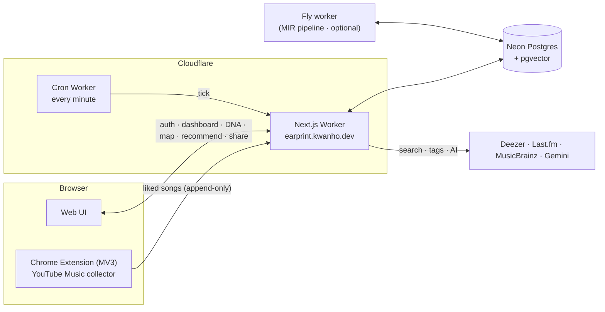
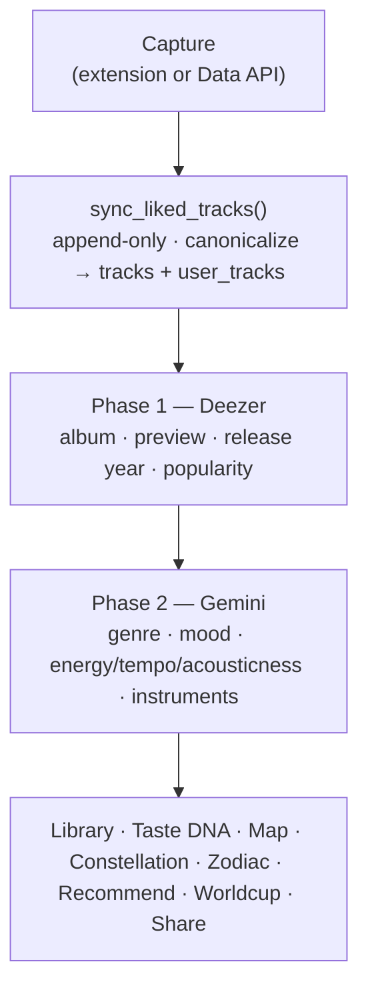

<div align="center">
  
  <h1>Earprint</h1>
  <p><strong>Turn your YouTube Music likes into an interactive portrait of your taste.</strong></p>
  <p>
    <a href="https://earprint.kwanho.dev">🌐 earprint.kwanho.dev</a> ·
    <a href="https://chromewebstore.google.com/detail/nfhgnpjhiencoajdfdadegnfbbhfjjkj">🧩 Chrome extension</a> ·
    <a href="https://earprint.kwanho.dev/guide">📖 Setup guide</a> ·
    <a href="https://earprint.kwanho.dev/demo">🎧 Sample report (no sign-in)</a>
  </p>
</div>

Earprint reads the songs you've **liked on YouTube Music**, analyzes them with Gemini, and renders an interactive picture of *why* you listen to what you listen to — top artists, an artist map, a 12-archetype music zodiac, an AI music-psychology profile, taste-bracket Worldcup, and a shareable persona page.

> YouTube Music has no public "my liked songs" API. The Chrome extension does the collection by reading your own page in your own logged-in tab; the web app does everything else.

---

## A look inside

| | |
|---|---|
|  |  |
| **Landing & shareable music personas** | **AI music-psychology profile** |
|  | |
| **Interactive artist map** |  |

---

## Importing your library

| Path | Coverage | How |
|---|---|---|
| 🧩 **Chrome extension** | Full Liked Music | Reads `music.youtube.com/playlist?list=LM` in your own logged-in tab. Periodic partial uploads survive a tab crash; manual Stop button lets you end early. |

The YouTube Data API was tried as a "Fast / mobile-friendly" alternative and removed — it only exposes YouTube's "Liked Videos" playlist, not YT Music's "Liked Music", and testers consistently saw 20-30% of their actual library. The extension is now the only import path.

Sync is **append-only** — once a song lands in your Earprint library, un-liking it on YouTube Music does **not** remove it. Earprint is your permanent "everything I've ever liked" history. Use the per-artist Hide controls on `/library` to drop something from stats without deleting it.

---

## What it does

| Area | Feature |
|---|---|
| **Collect** | Chrome MV3 extension scrolls the YouTube Music Liked Music list with periodic partial uploads (so a tab crash doesn't lose progress) and a manual **Stop now** button |
| **Analyse** | Deezer enrichment (album · preview · release year · popularity) + Gemini per-track AI (genre · mood · energy / tempo / acousticness · instruments) |
| **Library** | Top artists / genres / moods / instruments, album-depth, audio-feel chart, data-confidence rollup, artist hide/restore |
| **Taste DNA** | Reminiscence-bump *imprint core* + a familiarity↔novelty index from genre entropy and mainstream-distance |
| **Artist map** | Force-directed canvas of your artists; unheard but related artists appear as empty circles you can add with one tap |
| **Music Zodiac** | 12 archetypes derived from your top genres + moods (not astrology — taste constellation) |
| **AI profile** | Gemini-written persona, headline, traits, digging score, improvement tips — once per analysis credit |
| **Recommend** | Five modes (song · genre · unheard-genre · indie · mix), swipe-style rating with optimistic-rollback on failure |
| **Worldcup** | Self-bracket from full library (random / recent / forgotten) + genre / discover / mix modes, 8–256 sizes |
| **Share** | `/s/<id>` public page with native share-sheet integration on mobile + dynamic OG image |

## The idea — research, not vibes

The app isn't another year-end recap; it tries to *explain* taste through three established bodies of music-psychology research:

- **Prediction & reward.** Musical pleasure peaks at the sweet spot between predictability and surprise (Huron's *Sweet Anticipation*; Gold et al., *J. Neuroscience* 2019; Salimpoor et al., *Nature Neuroscience* 2011). The **novelty index** places a library on a familiarity↔novelty axis from genre entropy, sub-genre specificity and distance from the mainstream.
- **The reminiscence bump.** Music heard at ~15–25 (emotional peak ≈ 17) is encoded with unusually strong memory traces. The **imprint core** overlays that window on the library's release-year histogram.
- **Taste trajectory & openness.** Discovery peaks ~24 and crystallises ~31–33 as the Openness trait declines (Rentfrow & Gosling, 2003; Cambridge "musical ages"). The imprint stage labels a listener as still-digging / imprinted / balanced.

## Architecture



- **Web app + Cron worker** run serverless on Cloudflare Workers (OpenNext adapter).
- **Neon Postgres** with pgvector for AI embeddings.
- **Fly worker** (`services/analysis`) is scaffolded for an Essentia + Discogs-EffNet MIR pipeline, currently `DRY_RUN=true` until the model cache lands on R2.
- No email transport — analysis results stay in-app; users share via OS native share sheet from `/library`.

## Data pipeline



Both phases are cached per-track: same canonical `(artist, title)` analysed once even if many users like it. The per-track analysis row never expires — re-running analysis just bumps the AI profile, not the per-track inference.

## Pricing

- **Free** — `₩0` / `$0`. Starter credit (1 AI profile), library up to 500 tracks, all dashboards / zodiac / share / worldcup.
- **Single Analysis** — `₩2,500` / `$1.99` / `€1.99`. One additional AI profile, no subscription.
- Pro monthly subscription is paused until the analysis-history feature lands.

Margin at ₩2,500: Lemon Squeezy ~$0.59 fee + Gemini ~$0.014 cost = ~$1.25 net per sale.

## Tech stack

- **Extension** (`apps/extension`): MV3, TypeScript, Vite + CRXJS, `chrome.i18n`
- **Web** (`apps/web`): Next.js 15 (App Router), TypeScript, Tailwind, Auth.js v5 (Google OAuth + incremental YouTube scope), HTML5 canvas for the maps, Zod for runtime validation
- **Cron** (`apps/cron`): scheduled Worker driving background jobs
- **MIR** (`services/analysis`): FastAPI + Essentia, Python, Dockerised on Fly
- **Hosting**: Cloudflare Workers (OpenNext adapter)
- **DB**: Neon Postgres + pgvector
- **External**: Deezer · Last.fm · MusicBrainz · Google Gemini · Lemon Squeezy
- **Monorepo**: pnpm workspaces + Turborepo

## Repo layout

```
apps/
  extension/          Chrome MV3 collector  +  store-assets/  +  LOAD-LOCALLY.md
  web/                Next.js app + API routes
  cron/               minute cron worker
services/analysis/    Python MIR (Essentia) on Fly
db/schema.sql         full schema (functions, append-only sync, jobs, MIR)
packages/shared/      shared TypeScript types (SyncRequest, CapturedTrack, …)
```

See [ARCHITECTURE.md](./ARCHITECTURE.md) for design rationale and [DEPLOY.md](./DEPLOY.md) for full deployment steps.

## Self-hosting

1. **Neon** — create a Postgres project → SQL Editor → paste `db/schema.sql` → Run. Idempotent on re-runs.
2. **Secrets**: Google OAuth (`AUTH_GOOGLE_ID`/`AUTH_GOOGLE_SECRET`), Last.fm (`LASTFM_API_KEY`), Gemini (`GEMINI_API_KEY` — **enable billing on the GCP project for KR / non-US regions**), optionally Lemon Squeezy (`LEMON_*`), optionally Sentry (`SENTRY_DSN`).
3. **Deploy web**: `pnpm --filter @playlist-analyzer/web run deploy`.
4. **Build extension**: `pnpm --filter @playlist-analyzer/extension run build`. Test locally with `apps/extension/LOAD-LOCALLY.md`, upload `earprint-extension-v*.zip` to the Chrome Web Store.

## Status & limitations

- **List completeness** — very large liked lists (2k+) can be slow to scroll; the extension uploads partial state every ~250 tracks so a tab crash never wipes progress. Manual **Stop now** button lets the user end early.
- **Metadata coverage** — release year / popularity come from Deezer, which doesn't match every track (esp. obscure / non-Western releases). The Deezer match has a per-row confidence; below 0.65 we suppress year / rank / preview to avoid showing wrong-artist data as ground truth.
- **MIR not yet enabled** — `services/analysis` is scaffolded but `DRY_RUN=true` until the model cache + R2 setup land. Per-track audio characteristics are Gemini-estimated for now.
- **Pro subscription paused** — re-introduces with analysis-history (so "did my taste change since May?" has a real answer).

## Revoking Earprint's Google permission

If you signed in to Earprint and later want to remove its access entirely (including the deprecated `youtube.readonly` scope that earlier dev/preview builds requested), do it from your Google Account:

1. Visit https://myaccount.google.com/permissions
2. In the list, find **Earprint** (or whichever name your local build registered with — `earprint` / `earprint-dev` / your custom OAuth client name)
3. Click → **Remove access**
4. Confirm. Any stored OAuth tokens on the Google side are invalidated instantly.

Earprint's own copy of your library is separate from that revoke. To also delete the library, sign in to https://earprint.kwanho.dev/account and use **Delete my account & data** (type `DELETE` to confirm) — that cascades through every user-scoped row in one DB transaction.

If you want to remove just the synced tracks but keep the account, use the per-artist **Hide** controls on `/library`. Sync is append-only, so re-running sync after a hide doesn't bring the artist back to the stats.

## License

[MIT](./LICENSE)
